# SaaS-App Project
saas-rnd-sample-production-9686.up.railway.app

This project is a part of my ongoing journey to master the art of building Software as a Service (SaaS) applications. Through this endeavor, I'm not just learning how to write code but also how to architect scalable, maintainable, and efficient systems. The goal is to create a solid foundation that can be reused across different SaaS products while leveraging modern web development tools and best practices.

## Technologies Used

### 1. Django
Django is the core framework used to build the backend of this application. It provides robust features like ORM, authentication, and admin panel out of the box, which accelerates the development process.


### 2. Tailwind CSS
Tailwind CSS is utilized for styling the frontend. Its utility-first approach makes it easier to design responsive and clean user interfaces without writing custom CSS.


### 3. htmx
htmx is used to enhance the interactivity of the web pages without the need for heavy JavaScript frameworks. It allows me to create dynamic UIs with fewer lines of code, making the frontend more responsive and performant.


### 4. Neon Postgres
Neon is a cloud-native Postgres database service used for storing and managing application data. It offers scalability and performance optimizations that are crucial for SaaS applications.


### 5. Redis
Redis is employed for caching and session management, improving the overall speed and efficiency of the application.


## Database Management

The application uses Neon Postgres as the primary database. Neon provides a fully managed Postgres database that is easy to set up and scale. For caching, Redis is integrated to reduce the load on the database and speed up query responses.

### Steps to Set Up the Database:

1. **Authenticate & Create a Project:**
   ```bash
   neonctl auth
   neonctl projects create --name saas


2. **Get Connection String:**

    ```bash
    neonctl connection-string --project-id "$PROJECT_ID"

3. **Set the Connection String in the .env file.**

## Deployment

Deployment is a crucial part of any SaaS application. In this project, I am exploring different deployment strategies to ensure that the application can scale effectively and handle traffic spikes.

### Deployment Tools:

- **Docker:** Used to containerize the application, making it easy to deploy across different environments.


- **Railway:** A platform-as-a-service (PaaS) provider used for hosting the application. Railway simplifies the deployment process by automating environment setups and scaling.


## Continuous Integration and Testing with GitHub Actions

In my project, I use GitHub Actions to automate testing and deployment, ensuring that my code is reliable and of high quality. I've set up multiple workflows to handle different aspects of the application, such as setting up the environment, integrating with the database, and managing secrets.

### GitHub Actions Workflows 

1. **Test Django Basic:** This workflow sets up the Python environment, installs the necessary dependencies, and runs Django tests to check the basic functionality of the application.

2. **Test Django Environment Variables:** In this workflow, I ensure that the application operates correctly with production-like environment variables, including disabling Django's debug mode and generating a secure secret key.


3. **Test Django with Actions Secret Database URL:** This workflow tests the application against a Neon database. It securely retrieves the database connection URL from GitHub Secrets, allowing me to validate database interactions without exposing sensitive information.

4. **Branch Neon DB for Django Tests:** This advanced workflow branches a Neon database specifically for testing. It creates a new branch in the Neon database for each CI run, runs the Django tests against this branch, and then cleans up the branch afterward. This approach ensures that my tests are executed in a clean, temporary environment that closely simulates production.

5. **Scheduled Production Worker:** I use this workflow to automate routine maintenance tasks, such as performing database migrations, synchronizing user subscriptions, and cleaning up any dangling Stripe subscriptions. It's scheduled to run periodically, ensuring these tasks are consistently and reliably handled.

### Example: Branch Neon DB for Django Tests

In the "Branch Neon DB for Django Tests" workflow, I dynamically create a new Neon database branch each time the tests are triggered. This workflow:

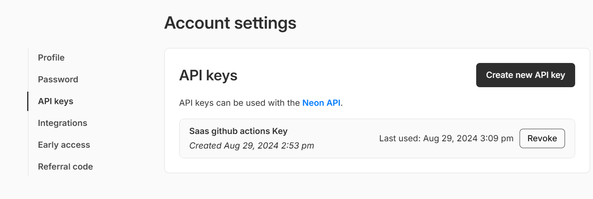
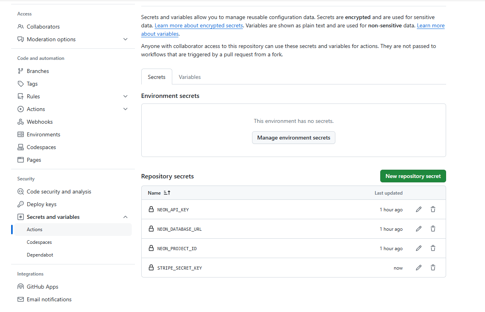
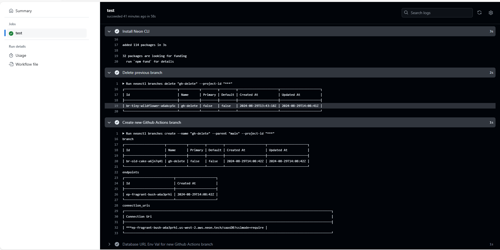

- Installs the Neon CLI.
- Generates a unique branch name based on the GitHub run ID.
- Creates a new branch in the Neon database specifically for isolated testing.
- Sets up a connection string to this branch and passes it to the Django environment.
- Runs the necessary database migrations and Django tests.
- Cleans up the Neon database branch after the tests complete, ensuring no lingering resources.

This approach allows me to run tests in an environment that mirrors production while maintaining isolation, so the production database remains unaffected.
## Screeshots of the Saas application:
* **Main Page:** 
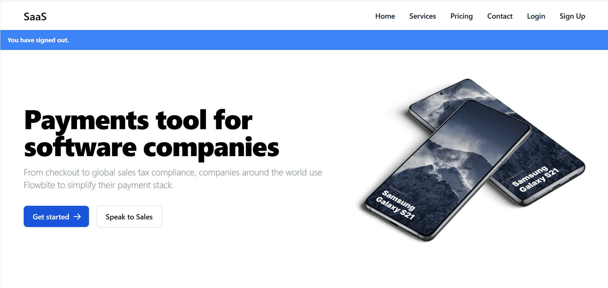
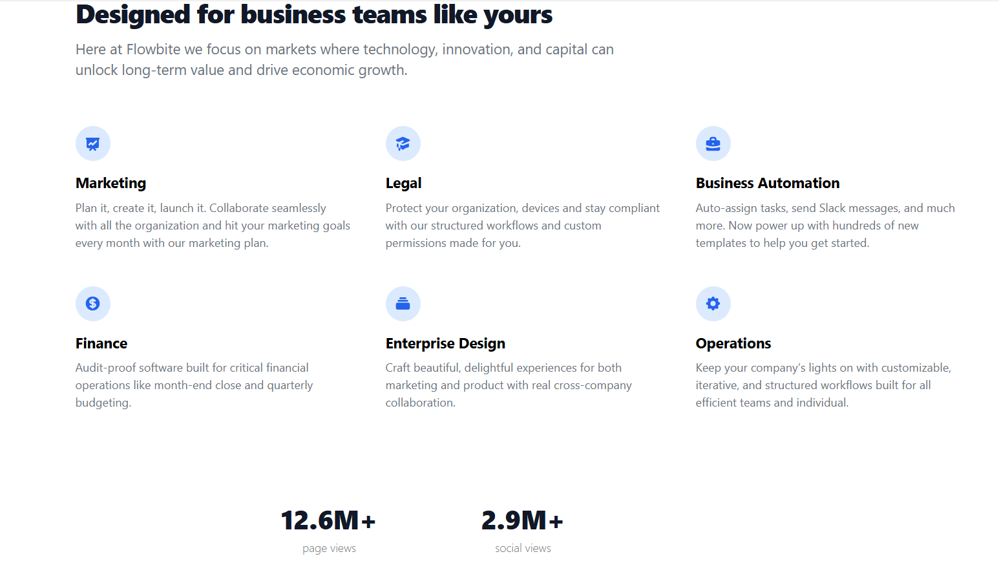

* **Sign Up Page:** 
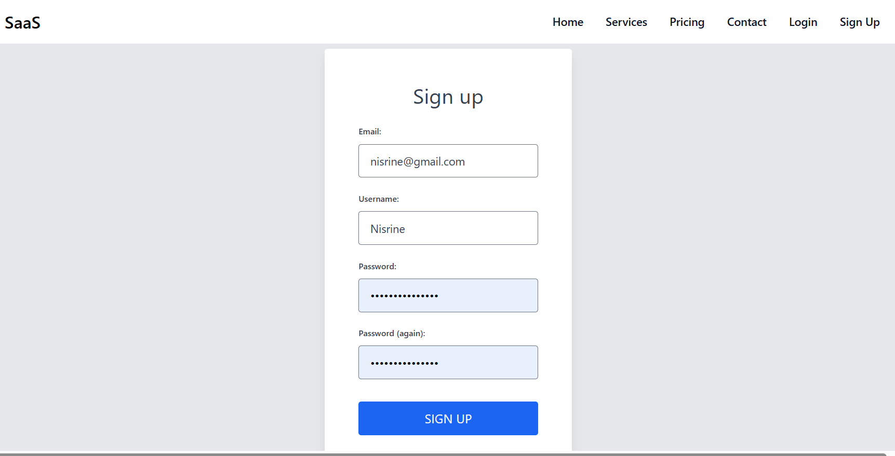

* **Sending email verification:** 
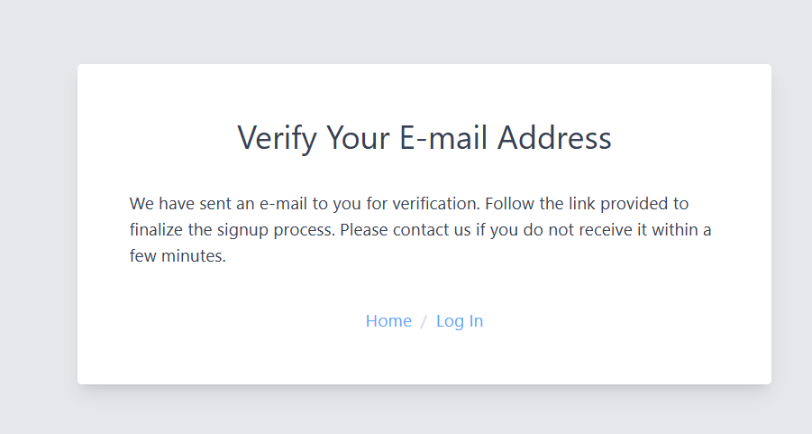


* **Login Page:** 
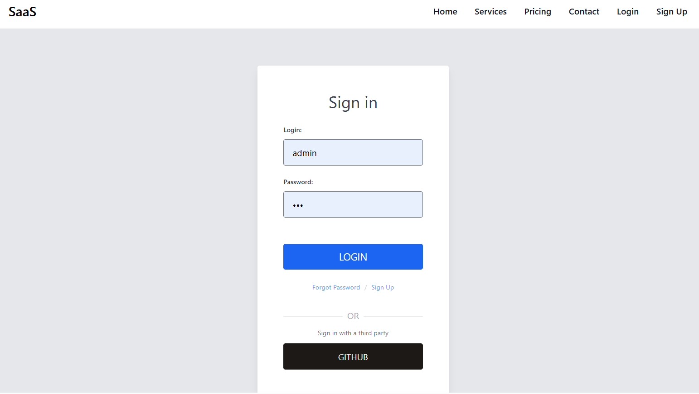

* **Login with Github:** 
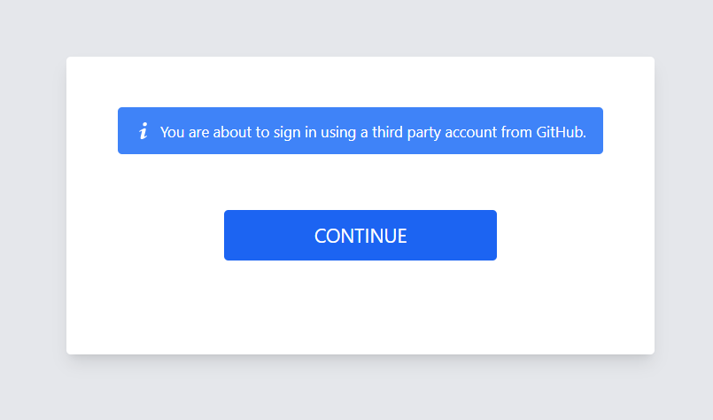
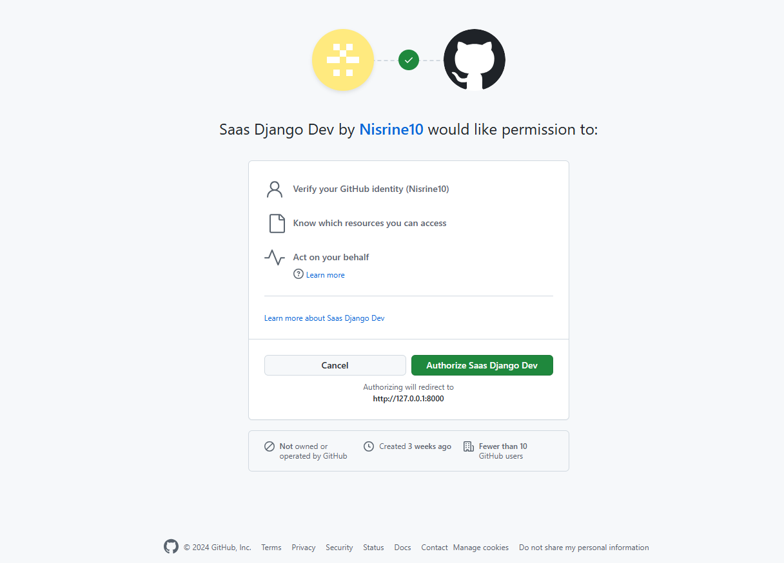

* **Reset Password:** 
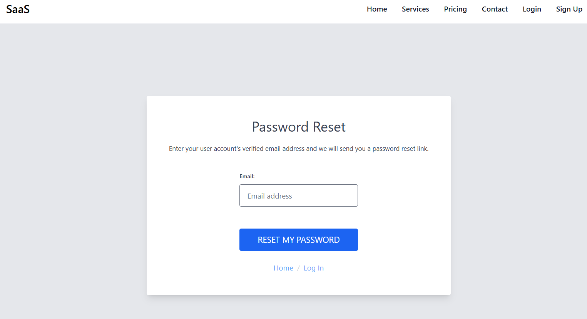
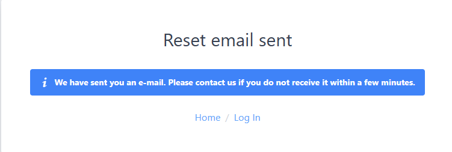
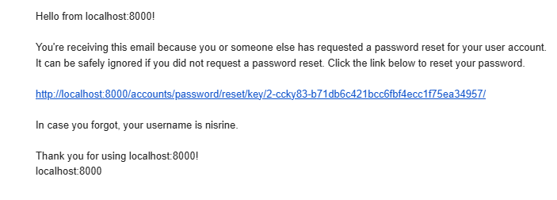
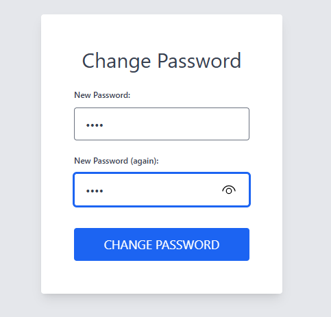
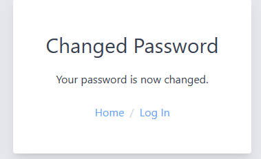

* **Home Page:** 
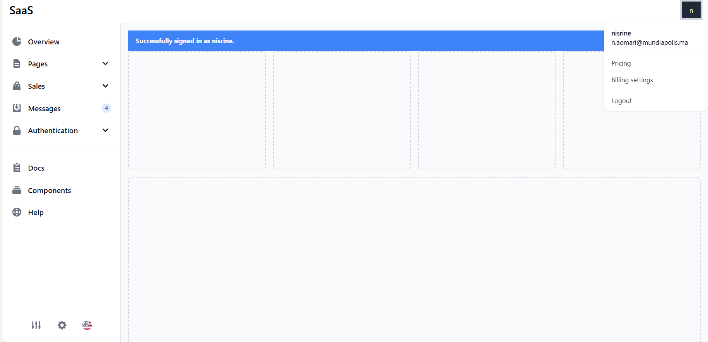

* **Pricing and Billing Page:** 


* **Sign out Page:** 
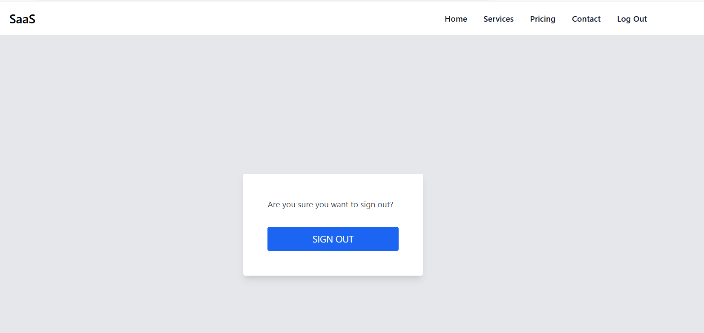

## Getting Started

### Create Virtual Environment

*Windows*
```bash
c:\Python312\python.exe -m venv venv
.\venv\Scripts\activate
```

### Install Requirements
```bash
# with venv activated
pip install pip --upgrade && pip install -r requirements.txt
```

### Sample dotenv to dotnev

```bash
cp .env.sample .env
cat .env
```
Values include:
- `DJANGO_DEBUG=1`
- `DJANGO_SECRET_KEY=""`
- `DATABASE_URL=""`
- `EMAIL_HOST="smtp.gmail.com"`
- `EMAIL_PORT="587"`
- `EMAIL_USE_TLS=True`
- `EMAIL_USE_SSL=False`
- `EMAIL_HOST_USER=""`
- `EMAIL_HOST_PASSWORD=""`
- `ADMIN_USER_EMAIL=""`
- `STRIPE_SECRET_KEY=""`


### Create the _DJANGO_SECRET_KEY_

```bash
python -c 'from django.core.management.utils import get_random_secret_key; print(get_random_secret_key())'
```
or
```bash
openssl rand -base64 64
```
or
```bash
python -c 'import secrets; print(secrets.token_urlsafe(64))'
```

Once you have this value, add update `DJANGO_SECRET_KEY` in `.env`.


### Create [Neon](https://kirr.co/eu0b31) Postgres Database


#### Install Neon CLI
Using the [Neon cli](https://neon.tech/docs/reference/cli-install) via [homebrew](https://brew.sh/):

```bash
brew install neonctl
```

#### Login to Neon CLI

```bash
neonctl auth
```
This will open a browser window to login.

####  Create a new Neon project (optional)
```bash
neonctl projects create --name saas
```

#### Get the Project ID

Once created, get the project id: 

```bash
neonctl projects list
```
#### Get the Database Connection String

```bash
neonctl connection-string --project-id "$PROJECT_ID"
```
Set this value to `DATABASE_URL` in `.env`. 


### Run Migrations

```bash
source venv/bin/activate 
# or .\venv\Scripts\activate if windows
cd src
python manage.py migrate
```

### Create a Superuser

```bash
python manage.py createsuperuser
```

### Pull Vendor Static Files

```bash
python manage.py vendor_pull
```


### Create a Stripe Account

1. Sign up on [Stripe.com](https://www.stripe.com) for an account
2. Get or create a Stripe Secret API Key (Dashboard > Developers > API keys > _Secret key_ )
3. Update _dotenv_ (`.env`) with the value `STRIPE_SECRET_KEY` with your key.

## Conclusion

This project is more than just a codebase—it's a learning experience that encapsulates the process of building a real-world SaaS application from the ground up. By working through the setup, integration, and deployment processes, I’m gaining valuable insights into modern web development and SaaS architecture.
